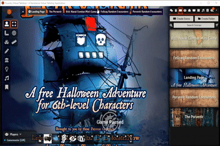
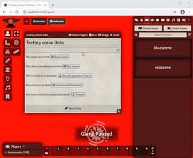

 

  

# Scene Clicker
A [FoundryVTT](https://foundryvtt.com/) module that changes the behavior of left clicking on a Scene. When this module is activated, ileft-clicking on a Scene will "view" the Scene instead of rendering the Scene Config Sheet.

# Instructions
This module requires no setup. Simply activating it in your world will override the left-click behavior on Scenes.

# Instructions
- Step 1: activate this module in your world 
- Step 2: in the Scenes Directory panel or in Journal Entries, left-click on any of your scenes
- Step 3: bask in the glory of viewing the Scene instead of having the Scene Config Sheet pop up

# Changelog

## 0.0.7 - Released on 2021-01-10
Added support to clicking on Journal links. Special thanks to [ruipin](https://github.com/ruipin) for his help troubleshooting!!!!

## 0.0.6 - Released on 2020-12-25
Initial release. Merry Christmas, y'all <3

# Acknowledgements

## LoFD's Module Template
This module relied heavily on [The League of Foundry Developer's FoundryVTT Module Template](https://github.com/League-of-Foundry-Developers/FoundryVTT-Module-Template). This is a great resource to get started in developing cool stuff for FoundryVTT!

## ruipin's libWrapper
This module uses [ruipin's libWrapper library](https://github.com/ruipin/fvtt-lib-wrapper). Take a look at his stuff if you want to develop modules for FVTT that override its default behaviors.

## D20 Day Hackathon
This module was originally developed during the [D20 Day Hackathon](https://www.reddit.com/r/FoundryVTT/comments/k8ly5i/the_1st_annual_d20_day_hackathon/) in 2020. 
